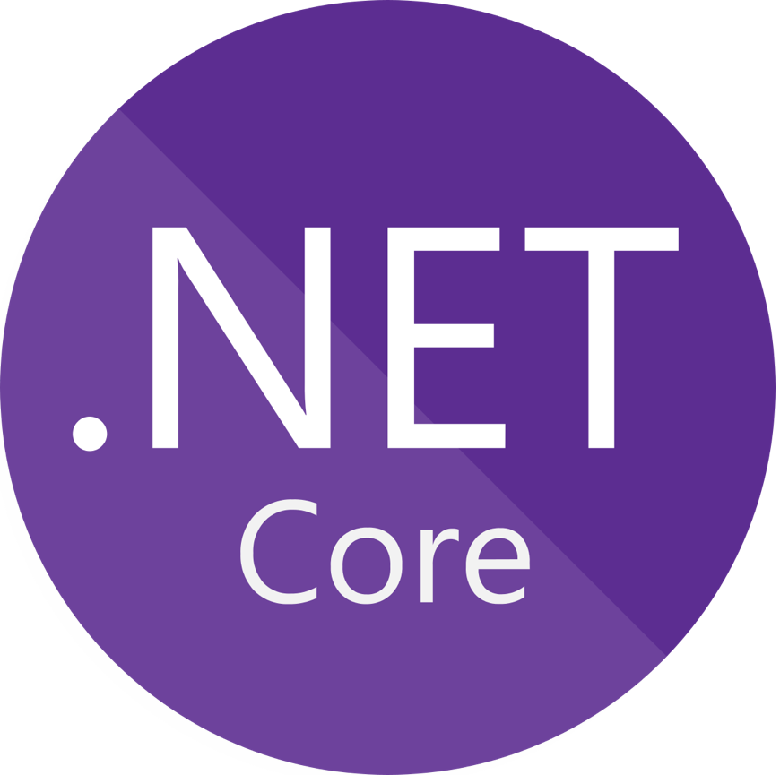
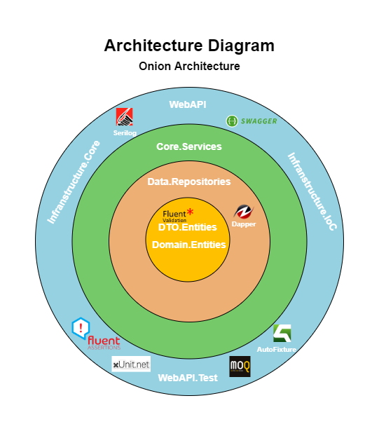

<div align="center" style="text-align:center">
<div style="disply:flex; justify-content: center;">




</div>

# .NET API Boilerplate

</div>

This boilerplate was created to serve as a base project for a quick start of an API in .NET, with a structured architecture opened for scalability and easy to maintenance.

In this documentation are the specifications of each page and important files, as well as the conventions to be followed.

## Technical specification 
Below are the diagrams related to the project and how it was designed, with the architecture diagram showing the significant nugget packages included.

There is also, for a better perception of the project, a tree of folders with the types of framework version used in each one.

<div align="center" style="text-align:center">

</div>
<br/>

```
Boilerplate
└───1 - Entities
│       │   Domain.Entities
│       │   DTO.Entities
└───2 - Repositories
│       │   Data.Repositories
└───3 - Services
│       │   Core.Services
└───4.1 - Infranstructure
│       │   Infrastructure.Core
│       │   Infrastructure.IoC
└───4.2 - Presentation
│       │   WebAPI
└───4.3 - Tests 
        │   WebAPI.Tests
```

Notes:
* .NET Standard 2.0 &#8594; Layer 1 to 4.1
* .NET 5 &#8594; Layer 4.2 to 4.3
   
## Architecture
As architecture, Onion Architecture was chosen because it offers separation of the business logic and repository/database.

Here, the objective will be separate the business logic and repositories where the data will be save, dividing them into layers that will work autonomously.

In this sense, and for better code maintenance, the above layers are aware of the below layers, but the opposite does not happen.

The layer-based architecture allows us to exchange an entire layer for a new one, for example, if we have a layer that communicates with the sql database we can replace it with another that communicates with the Mongo database. It is easier to change layers, add new services and / or change existing services.

### Main conventions to follow

* Above layers are aware of the below layers, but the opposite does not happen
* Data transfer between layers must be done through a data transfer protocol such as DTO (Data Transfer Object)
* The layers/services should only do what is their job. For example: the presentation layer should not save data or have business logic.

In this [link](https://www.codeguru.com/csharp/understanding-onion-architecture) there is a more detailed explanation of the chosen architecture.

## Features
Below is a list of basic features that this API offers:
1. Structured architecture based on layers
2. API request examples
3. Log events using Serilog
4. FluentValidation
5. Unit test examples in xUnit

# Getting Started
To setup the project locally a few steps need to be followed.

1. Clone the repo 
    ```
    git clone https://github.com/adilsonmsoares/API_Boilerplate
    ```
2. Open the cloned project
   
   If you need to install all packages, use the following command on the package manager console:
   
    ```
    Update-Package –reinstall
    ```
3. Build and run the Project

# Contribute
To contribute to this project, first of all, new developers need to understand the architecture used and read the convention determined for this project in order to proceed with the developement.

Contributions are what make the open source community such an amazing place to be learn, inspire, and create. Any contributions you make are greatly appreciated.

1. Create your Feature Branch (git checkout -b feature/AmazingFeature)
2. Commit your Changes (git commit -m 'Add some AmazingFeature')
3. Push to the Branch (git push origin feature/AmazingFeature)
4. Open a Pull Request